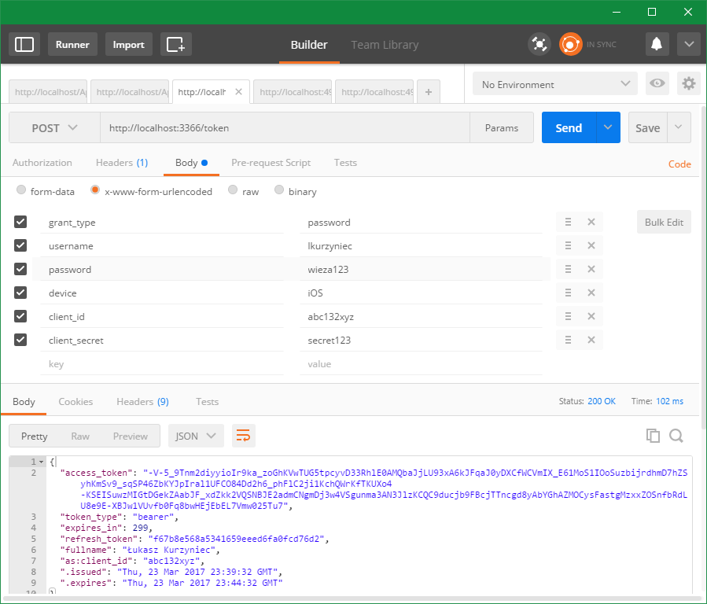
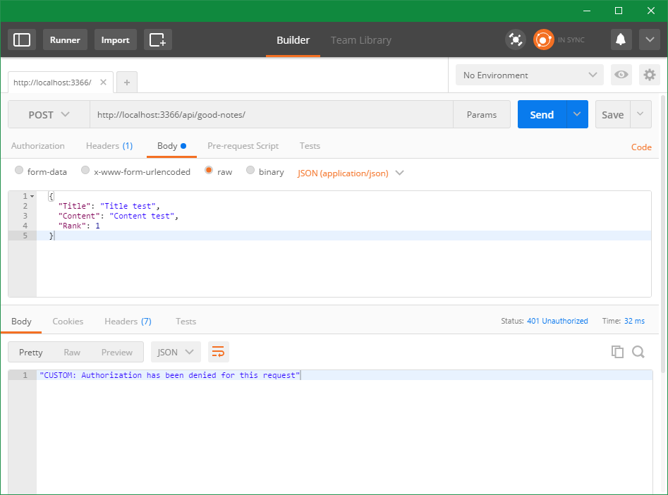
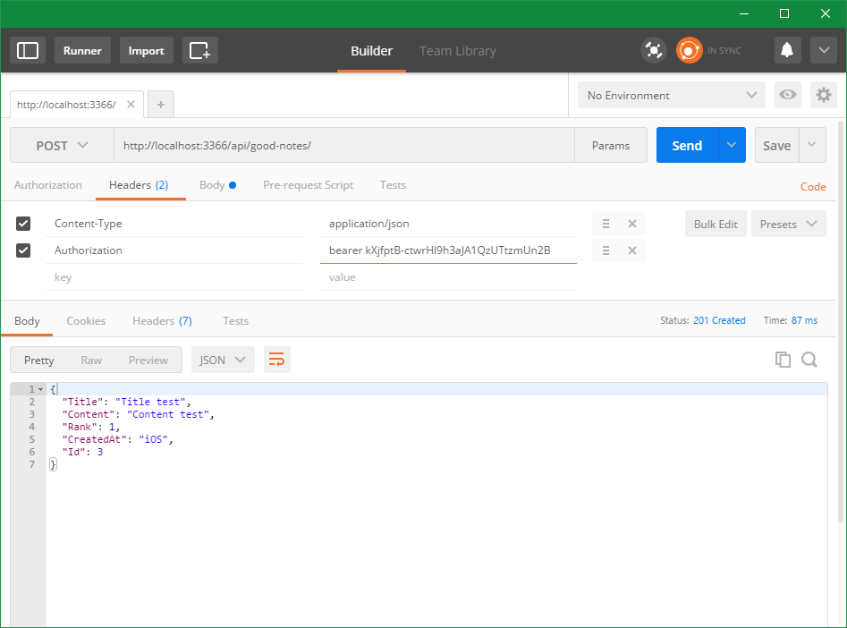
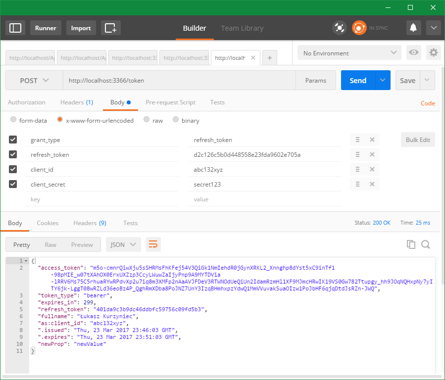
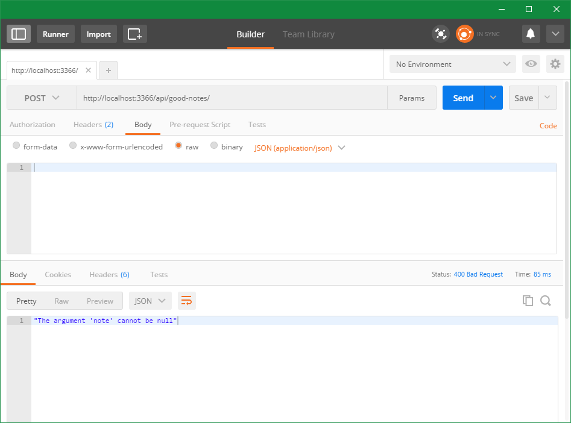
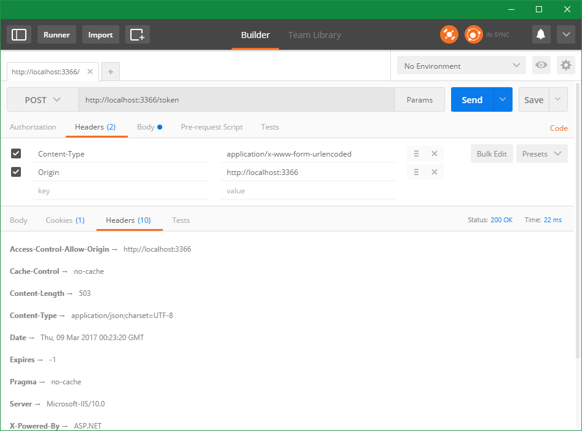
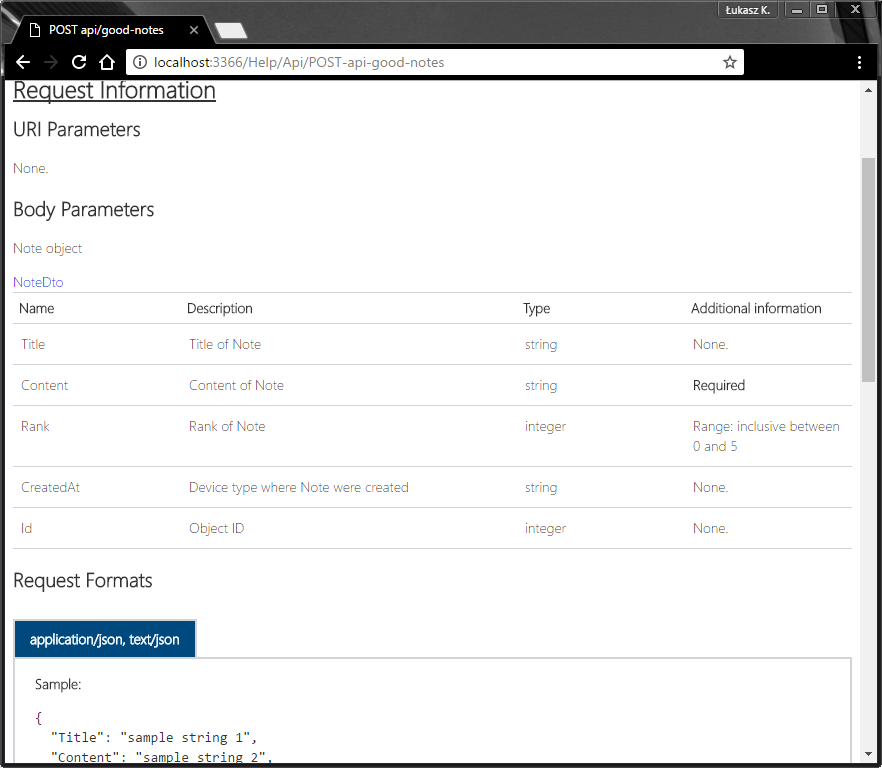

# YellowNotes

Sample ASP.NET Web API project with OAuth authentication and many other extensions.

## Table of contents

1. [The basics of API (CRUD)](#1-the-basics-of-api-goodnotescontroller)
2. [Validation](#2-validation)
3. [Authentication and authorization](#3-authentication-and-authorization)
4. [Other](#4-other)
5. [Samples](#5-samples)
6. [Useful links](#6-useful-links)

---

## 1. The basics of API ([GoodNotesController](YellowNotes/YellowNotes.Api/Controllers/GoodNotesController.cs))

* Create -> Post
* Read -> Get
* Update -> Put
* Delete -> Delete

## 2. Validation

* Basic validation (via [DataAnnotations](https://msdn.microsoft.com/en-us/library/system.componentmodel.dataannotations.aspx) attributes)
* ModelState validation ([ValidateModelStateAttribute](YellowNotes.Api/Attributes/ValidateModelStateAttribute.cs))
* Model empty validation ([CheckModelForNullAttribute](YellowNotes.Api/Attributes/CheckModelForNullAttribute.cs))
* Action parameters validation ([ActionParametersValidationAttribute](YellowNotes.Api/Attributes/ActionParametersValidationAttribute.cs))

## 3. Authentication and authorization

* Access Token (OAuth bearer token authentication using OWIN middleware) ([SimpleAuthorizationServerProvider](YellowNotes.Api/Providers/SimpleAuthorizationServerProvider.cs))
* Client credentials validation
* Token custom parameter
* Authentication Ticket custom property
* Custom claim
* Refresh Token ([SimpleRefreshTokenProvider](YellowNotes.Api/Providers/SimpleRefreshTokenProvider.cs))
* Custom Authorize attribute ([SimpleAuthorizeAttribute](YellowNotes.Api/Attributes/SimpleAuthorizeAttribute.cs))

## 45. Other

* Dependency Injection with Autofac ([DependencyConfig](YellowNotes.Api/App_Start/DependencyConfig.cs))
* API documentation page with Swagger ([SwaggerConfig](YellowNotes.Api/App_Start/SwaggerConfig.cs))
* API exceptions handling ([RequestExceptionAttribute](YellowNotes.Api/Attributes/RequestExceptionAttribute.cs))
* Working CORS (Cross-Origin Resource Sharing) implementation ([CorsProvider](YellowNotes.Api/Providers/CorsProvider.cs))
* Simple Owin middleware to rewrite header from request to response  ([CorrelationIdHeaderRewriterMiddleware](YellowNotes.Api/Middlewares/CorrelationIdHeaderRewriterMiddleware.cs))

---

## 5. Samples

### Token generation

### Access to resource denied

### Access to resource granted

### Refresh Token utilise

### Model validation

### CORS (Cross-Origin Resource Sharing)

### API Documentation page

---

## 6. Useful links

* HTTP Status Codes: https://www.restapitutorial.com/httpstatuscodes.html
* Choosing an HTTP Status Code: ~~http://racksburg.com/choosing-an-http-status-code~~ https://www.ruilog.com/notebook/view/f21862318f93.html
